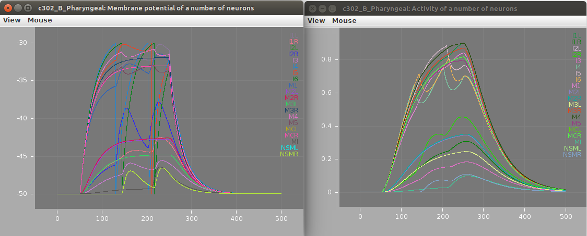
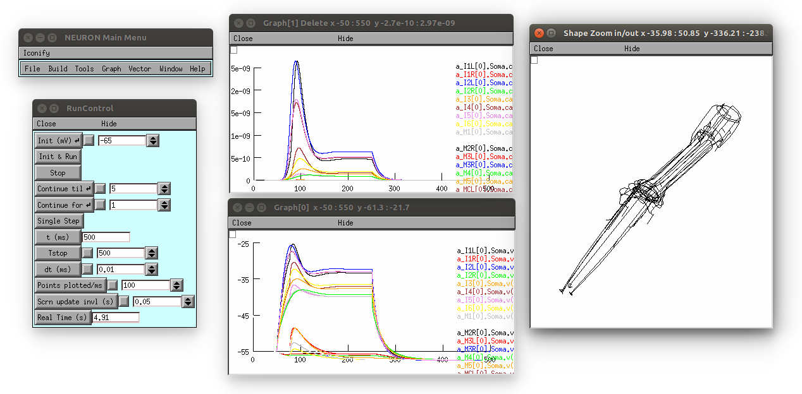

## The c302 modelling framework for *C. elegans*

c302 is a framework for generating network models in NeuroML 2 based on C elegans connectivity data. *Note: the c302 framework has recently moved to this repository from https://github.com/openworm/CElegansNeuroML/tree/master/CElegans/pythonScripts/c302*.

It uses information on the synaptic connectivity of the network (from
[here](https://github.com/openworm/c302/blob/master/c302/data/CElegansNeuronTables.xls)) and uses
[libNeuroML](https://github.com/NeuralEnsemble/libNeuroML) to generate
a network in valid NeuroML, which can be run in [jNeuroML](https://github.com/NeuroML/jNeuroML) or [pyNeuroML](https://github.com/NeuroML/pyNeuroML).

### To install & test

The full set of dependencies for c302 can be installed with the following (see also the [Travis-CI script](https://github.com/openworm/c302/blob/master/.travis.yml)):

    git clone https://github.com/openworm/c302.git
    cd c302
    python setup.py install

This will install c302 as well as all dependencies, including [pyNeuroML](https://github.com/NeuroML/pyNeuroML) 
and [PyOpenWorm](https://github.com/openworm/PyOpenWorm).

#### Quick test

To ensure everything is set up correctly try:

1) Regenerate the NeuroML & LEMS files for one instance of the model:

       python c302/c302_Pharyngeal.py B  # generate pharyngeal network (see fig. above) using parameter set B

2) Run a simulation with pyNeuroML:

       pynml examples/LEMS_c302_B_Pharyngeal.xml      

To test all of the working features of the framework run [test.sh](https://raw.githubusercontent.com/openworm/CElegansNeuroML/master/CElegans/pythonScripts/c302/test.sh):

     ./test.sh  # or ./test3.sh if you use Python 3

### Usage Examples

#### 1a) Run standard examples with pyNeuroML

There are a number of [example models](https://github.com/openworm/c302/tree/master/examples) included with the standard distribution. 
These consist of: A) generated NeuroML 2 network description file ([example](https://github.com/openworm/c302/blob/master/examples/c302_A_IClamp.net.nml)), 
containing the definitions of the cells to use (e.g. **iafCell** for an integrate and fire cell), any inputs (e.g. **pulseGenerator**) as well as the 
**populations**, **projections** and **inputLists** contained within the **network** (for a full description of the NeuroML elements see 
[here](https://www.neuroml.org/NeuroML2CoreTypes/Networks.html)); and B) a LEMS simulation file 
([example](https://github.com/openworm/c302/blob/master/examples/LEMS_c302_A_IClamp.xml)) describing how long to simulate, the timestep and what to plot/record.

       # generate 2 neurons & 1 muscle with current inputs using parameter set A
       pynml examples/LEMS_c302_A_IClamp.xml      

       # generate full scale network using parameter set C
       pynml examples/LEMS_c302_C_Full.xml    

       # generate pharyngeal network using parameter set B
       pynml examples/LEMS_c302_B_Pharyngeal.xml

Screenshots of a simulation with pyNeuroML of c302_B_Pharyngeal are shown below:

#### 1b) Run standard examples with Neuron

The models can also be run using the Neuron simulator. This should be installed as outlined [here](https://www.neuron.yale.edu/neuron/download). 

       cd examples
       pynml LEMS_c302_A_IClamp.xml -neuron   # Generate the Neuron files (Python/hoc/mod)
       nrnivmodl                              # Compile the mod files (used for cell/ion channel definitions)
       nrngui LEMS_c302_A_IClamp_nrn.py       # Run the main Python file for the simulation using Neuron

Note: models with the D parameter set can only be run using Neuron (not pyNeuroML), simnce they consist of multicompartmental Neurons, e.g.

       pynml LEMS_c302_D_Pharyngeal.xml -neuron  
       nrnivmodl                         
       nrngui LEMS_c302_D_Pharyngeal_nrn.py

This produces the following (3D view on right can be produced by selecting in the Neuron main menu: Graph -> Shape plot)

### Command line interface

This package can be used to generate customised networks of varying size, with different cells stimulated, of varying duration from the command line:

    ./c302/__init__.py MyNetwork parameters_A -cells ["ADAL","AIBL","RIVR","RMEV"] -cellstostimulate ["ADAL","RIVR"] -duration 500

This will create a NeuroML 2 file and a LEMS file to execute it, containing 4 cells, stimulating 2 of them, and with a duration of 500 ms

More options can be found with

    ./c302/__init__.py -h

### Mapping to NEURON

Due to the fact that the cells are in pure NeuroML2, they can be mapped to other formats using the export feature of jNeuroML. [Install NEURON](http://www.neuron.yale.edu/neuron/download) and map the network to this format using:

    cd examples
    
for jNeuroML:

    jnml LEMS_c302_A_Pharyngeal.xml -neuron
    
or instead for pyNeuroML:    

    pynml LEMS_c302_A_Pharyngeal.xml -neuron
    
then

    nrnivmodl
    nrngui -python LEMS_c302_A_Pharyngeal_nrn.py

### Comparing activity across scales/parameter sets

See [here](https://github.com/openworm/c302/blob/master/examples/summary/README.md) for more details on this.

### Understanding how c302_Full.py works

