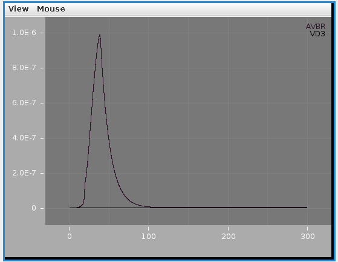
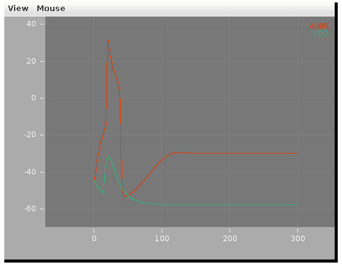

## The c302 modelling framework for *C. elegans*

[](https://github.com/openworm/c302/actions/workflows/ci.yml) [](https://github.com/openworm/c302/actions/workflows/non_omv.yml)

c302 is a framework for generating network models in NeuroML 2 based on *C. elegans* connectivity data. It is primarily intended as a way to generate neuronal networks at multiple levels of detail for the [OpenWorm project](http://www.openworm.org). To see how c302 relates to other OpenWorm subprojects click on the image below:

<p align="center"><a href="OpenWormOverview.md"></a></p>


It uses information on the synaptic connectivity of the network (from [here](https://github.com/openworm/c302/blob/master/c302/data)) and uses [libNeuroML](https://github.com/NeuralEnsemble/libNeuroML) to generate a network in valid NeuroML, which can be run in [jNeuroML](https://github.com/NeuroML/jNeuroML) or [pyNeuroML](https://github.com/NeuroML/pyNeuroML).

**The c302 paper is out!**

*c302: a multiscale framework for modelling the nervous system of Caenorhabditis elegans* Padraig Gleeson, David Lung, Radu Grosu, Ramin Hasani, Stephen D. Larson, [Phil. Trans. R. Soc. B 2018 373 20170379](http://rstb.royalsocietypublishing.org/content/373/1758/20170379); DOI: 10.1098/rstb.2017.0379.


### To install & test

The full set of dependencies for c302 can be installed with the following (see also the [ci.yml](https://github.com/openworm/c302/blob/master/.github/workflows/ci.yml) and [non_omv.yml](https://github.com/openworm/c302/blob/master/.github/workflows/non_omv.yml) workflow files):

```console
git clone https://github.com/openworm/c302.git
cd c302
pip install .

# The following can only be run on Mac and Linux. Note: c302 can be run without ownmeta fully installed
owm bundle remote --user add ow 'https://raw.githubusercontent.com/openworm/owmeta-bundles/master/index.json'
```

This will install c302 as well as [pyNeuroML](https://github.com/NeuroML/pyNeuroML) and [owmeta](https://github.com/openworm/owmeta).

For Windows users a  virtual environment must be generated with Python 3.10 as any newer versions do not currently support owmeta.

To run the test.sh script, the Neuron simulator is also required, and should be installed as described [here](https://www.neuron.yale.edu/neuron/download) (On Mac and Linux it can be installed with `pip install neuron`). 

For Linux users, additional dependencies (OpenJDK 19 and Graphviz) are required to run the usage examples:
    
    sudo apt-get install openjdk-19-jdk graphviz

Please note that Python3 is also required to run both the test.sh script and the Usage Examples. For convenience on Linux, it is recommended to install python-is-python3 prior to running the test.sh script.

    sudo apt-get install python-is-python3

#### Quick test

To ensure everything is set up correctly try:

1) Regenerate the NeuroML & LEMS files for one instance of the model:

       python c302/c302_Pharyngeal.py B  # generate pharyngeal network (see fig. above) using parameter set B

2) Run a simulation with pyNeuroML:

       pynml examples/LEMS_c302_B_Pharyngeal.xml      

To test all of the working features of the framework run [test.sh](https://raw.githubusercontent.com/openworm/CElegansNeuroML/master/CElegans/pythonScripts/c302/test.sh):

     ./test.sh

### Docker image

c302 is included in the **Docker** image which contains the complete OpenWorm simulation stack. Click on the image below for more details.

<p align="center"><a href="https://github.com/openworm/OpenWorm/blob/master/README.md#quickstart"></a></p>


### Usage Examples

#### 1a) Run standard examples with pyNeuroML

There are a number of [example models](https://github.com/openworm/c302/tree/master/examples) included with the standard distribution. These consist of: A) generated NeuroML 2 network description file ([example](https://github.com/openworm/c302/blob/master/examples/c302_A_IClamp.net.nml)), containing the definitions of the cells to use (e.g. **iafCell** for an integrate and fire cell), any inputs (e.g. **pulseGenerator**) as well as the **populations**, **projections** and **inputLists** contained within the **network** (for a full description of the NeuroML elements see [here](https://www.neuroml.org/NeuroML2CoreTypes/Networks.html)); and B) a LEMS simulation file ([example](https://github.com/openworm/c302/blob/master/examples/LEMS_c302_A_IClamp.xml)) describing how long to simulate, the timestep and what to plot/record.

       # generate 2 neurons & 1 muscle with current inputs using parameter set A
       pynml examples/LEMS_c302_A_IClamp.xml      

       # generate full scale network using parameter set C
       pynml examples/LEMS_c302_C_Full.xml    

       # generate pharyngeal network using parameter set B
       pynml examples/LEMS_c302_B_Pharyngeal.xml

Screenshots of a simulation with pyNeuroML of c302_B_Pharyngeal are shown below (left: membrane potential of 20 cells, right: "activity" of 20 cells - a value from 0-1 showing time smoothed activity of each cell):


#### 1b) Run standard examples with Neuron

The models can also be run using the Neuron simulator.  This should be installed as outlined [here](https://www.neuron.yale.edu/neuron/download). Note: running c302 with Neuron is not currently supported on Windows.

       cd examples
       pynml LEMS_c302_A_IClamp.xml -neuron   # Generate the Neuron files (Python/hoc/mod)
       nrnivmodl                              # Compile the mod files (used for cell/ion channel definitions)
       nrngui LEMS_c302_A_IClamp_nrn.py       # Run the main Python file for the simulation using Neuron

Note: models with the D parameter set can only be run using Neuron (not pyNeuroML), simnce they consist of multicompartmental Neurons, e.g.

       pynml LEMS_c302_D_Pharyngeal.xml -neuron  
       nrnivmodl                         
       nrngui LEMS_c302_D_Pharyngeal_nrn.py

This produces the following (graph on top is [Ca2+], bottom is membrane potential; 3D view on right can be produced by selecting in the Neuron main menu: Graph -> Shape plot)


#### 2) Use command line interface to create new network

The **c302** command line utility can be used to generate customised networks of varying size, with different cells stimulated, of varying duration from the command line:

    c302 MyNetwork parameters_C -cells ["AVBR","VD3"] -cellstostimulate ["AVBR"] -paramoverride {"unphysiological_offset_current":"2.9pA"} -duration 300

This will create a NeuroML 2 file and a LEMS file to execute it, containing 2 cells, stimulating 1 of them, and with a duration of 300 ms. It can be run with:

    pynml LEMS_MyNetwork.xml

This produces two plots: One is neuron activity, measured as calcium ion concentration. You will likely need to click "Frame" in the "View" menu to scale the plot.




The other shows membrane potential for each neuron in the network.




To see the structure of the network, use pyNeuroML (please note that Graphviz is required):

    pynml MyNetwork.net.nml -graph 4c  # Try other options like 1, 2f, 5c for varying levels of detail


More options for using the **c302** command can be found with

    c302 -h


#### 3) Change parameters in a file

To investigate how the behaviour of a model changes when parameters are varied, it is possible to change the parameters in the parameters_X.py files and regenerate.

For example in [parameters_C.py](https://github.com/openworm/c302/blob/master/c302/parameters_C.py) there are lists of parameters like:

```python
self.add_bioparameter("muscle_leak_cond_density", "5e-7 S_per_cm2", "BlindGuess", "0.1")
self.add_bioparameter("neuron_leak_cond_density", "0.005 mS_per_cm2", "BlindGuess", "0.1")
self.add_bioparameter("leak_erev", "-50 mV", "BlindGuess", "0.1")
```

To change the model behaviour alter one of these values, e.g.

```python
self.add_bioparameter("neuron_leak_cond_density", "0.02 mS_per_cm2", "BlindGuess", "0.1")
```

and look at the behaviour afterwards (note the package needs to be reinstalled)

    sudo python setup.py install           # reinstall package after change
    python c302/c302_IClamp.py C           # regenerate c302_C_IClamp
    pynml examples/LEMS_c302_C_IClamp.xml  # run simulation

The plots below show the neuron's membrane potential on application of 6 increasing pulses of current before (left) and after (right) the change, indicating how increasing the leak conductance removes the spiking:

<p> </p>

#### 4) Adding a new input type to NeuroML model

The structure of the model generated can be altered by modifying the NeuroML model returned in the c302_XXX.py script.
As an example, say we want to add a sine wave current to the Muscles network (specified by [c302_Muscles.py](https://github.com/openworm/c302/blob/master/c302/c302_Muscles.py)), as opposed to the steady current clamp input. This can be achieved by setting the "unphysiological_offset_current" to zero:

```python
params.set_bioparameter("unphysiological_offset_current", "0pA", "Disabling offset current", "0")
```

and (after calling c302.generate()) adding the new NeuroML element for the current and adding the input to a cell:

```python
# Import from libNeuroML      
from neuroml import SineGenerator, InputList, Input
import neuroml.writers as writers

# Create the sine wave current generator & add to NeuroML document
sw_input = SineGenerator(id='NewSineWaveInput',
                      delay='100ms',
                      phase='0',
                      duration='800ms',
                      amplitude='4.5pA',
                      period='200ms')

nml_doc.sine_generators.append(sw_input)

# Which cell to stimulate
cell = 'AVBL'

# create an InputList and add one Input to that cell
input_list = InputList(id="Input_%s_%s" % (cell, sw_input.id), component=sw_input.id, populations='%s' % cell)
input_list.input.append(Input(id=0, target="../%s/0/GenericNeuronCell"%cell, destination="synapses"))
nml_doc.networks[0].input_lists.append(input_list)

# Write over network file created already...
nml_file = target_directory+'/'+reference+'.net.nml'
writers.NeuroMLWriter.write(nml_doc, nml_file)
```

These changes are made in [c302_MusclesSine.py](https://github.com/openworm/c302/blob/master/c302/c302_MusclesSine.py)) and can be run with:

    python c302/c302_MusclesSine.py C
    pynml examples/LEMS_c302_C_MusclesSine.xml

Membrane potential of neurons (left; stimulated AVBL cell in green) and muscles (right) shown below:


Other types of NeuroML input elements are defined [here](https://www.neuroml.org/NeuroML2CoreTypes/Inputs.html)
and examples are shown [here](https://github.com/NeuroML/NeuroML2/blob/master/examples/NML2_Inputs.nml).


#### 5) View and execute the models on Open Source Brain

The Github repository for c302 is linked to a project on Open Source Brain: http://www.opensourcebrain.org/projects/c302. This allows exploration of the generated NeuroML 2 networks through the Geppetto enabled OSB 3D Explorer.

To see a list of the networks which can be visuaised, click on the **More** button on the top right of the page. As an example, the Pharyngeal network with parameter set D can be selected (c302_D_Pharyngeal.net.nml in the Network list, direct link [here](http://www.opensourcebrain.org/projects/c302/models?explorer=https%253A%252F%252Fraw.githubusercontent.com%252Fopenworm%252Fc302%252Fmaster%252Fexamples%252Fc302_D_Pharyngeal.net.nml)).

The initial view of the network is shown on the left below.

<p> </p>

To get the view on the right:
- change the background to white by clicking the paintbrush icon (bottom icon on left)
- open the connectivity matrix (Connectivity button, top left) showing the connections present between cells in an adjacency matrix
- press Connectivity button again and select Force-directed layout
- Run a simulation of the network
    - Persist project so simulations can be run (star on top middle). You will need to have [signed up for OSB](http://www.opensourcebrain.org/account/register) & logged in!
    - Press Run button; set duration to 0.4 seconds; press Submit
    - When dialog appears asking what to record, select all membrane potentials at somas. Simulation will be set running.
- After circle on Experiments tab has turned green, plot some of the recorded traces:
    - press the Control Panel icon (four horizontal lines, forth icon from botton on left)
    - show the list of state variables: x<sup>2</sup> button on top of this dialog. Ensure target button is selected (first of four buttons on right) to only show recorded variables
    - all recorded variables are shown, e.g. c302_D_Pharyngeal.I1L[0].Seg0_soma_0_0.v: membrane potential of soma in cell I1L. select which to plot with icons on right
- Replay the simulation:
    - use the time varying voltage of cells to color the corresponding 3D objects: Results -> Apply voltage colouring to morphologies
    - open the dialog for the simulation time: Results -> Show simulation time
    - replay the simulation: Results -> Play step by step (10x)

It is also possible to view and analyse other configurations, e.g. [c302_D_Full](http://www.opensourcebrain.org/projects/c302/repository/revisions/master/show/examples?explorer=https%253A%252F%252Fraw.githubusercontent.com%252Fopenworm%252Fc302%252Fmaster%252Fexamples%252Fc302_D_Full.net.nml):


### Comparing activity across scales/parameter sets

This page shows a set of generated simulations at each of the subnetwork/parameter set configurations, and
provides a quick overview of the activity of the different instances of c302:

<a href="https://github.com/openworm/c302/blob/master/examples/summary/README.md"></a>

**Note that c302 is still in active development and not all of the configurations are producing physiologically realistic results.**

### Background info: Understanding how c302_Full.py works

Overview of the files and packages used in the framework:

<a href="https://docs.google.com/drawings/d/1urLRCe--ymaFTevRWp-etS06E9Rl82b627lC4RmUumI/edit?usp=sharing"></a>

