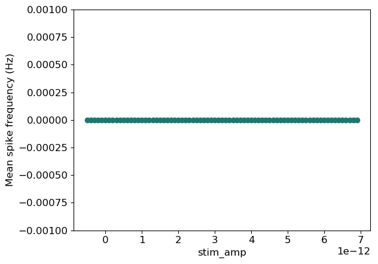
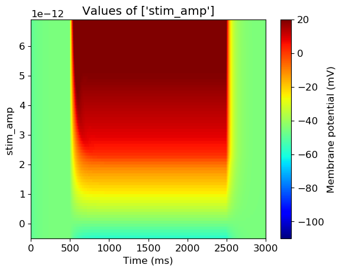

### c302 cell summary 
<table>
<tr>
  <td width=30><b>GenericNeuronCell</b></td>
  <td>
  </td>
  <td>
  </td>
  <td>
  </td>
  <td>
  </td>
  <td>
  </td>
  <td>
  </td>
<tr>
<tr>
  <td width=30><b>GenericMuscleCell</b></td>
  <td>
  </td>
  <td>
  </td>
  <td>
  </td>
  <td>
  </td>
  <td>
  </td>
  <td>
  </td>
<tr>
